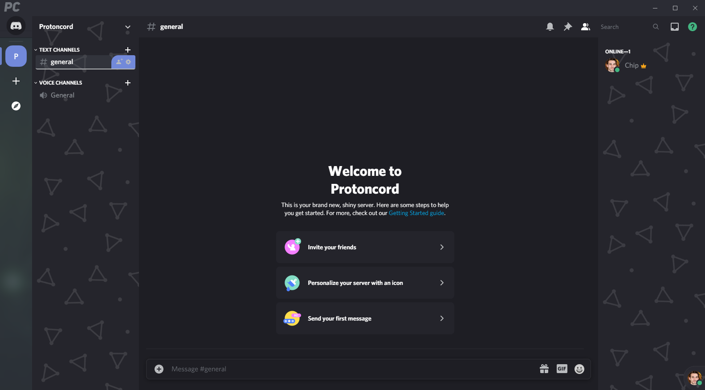
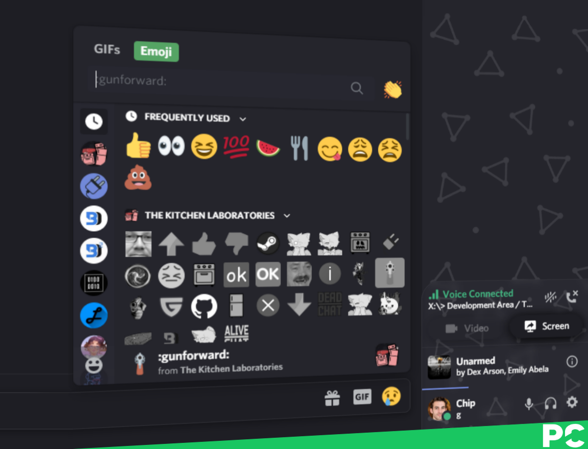

  </img>

A sleek, modern UI purely made in CSS for Discord.

Inspired by the layout of ProtonVPN.

## Attributes
* [UserBackgrounds](http://github.com/discord-Custom-Covers/usrbg/) Support
* [Glasscord](https://github.com/AryToNeX/Glasscord/) Support
* [DevTags](about:blank) Integration
* Sleek, modern UI

This theme is built up from the base of the [Glasscord Example Theme](https://github.com/AryToNeX/Glasscord/blob/master/extras/discord_example_theme/discord_example.theme.css). If you are a [ProtonVPN](https://protonvpn.com/) employee or a creator of the base and want this theme to be taken down, please message me via Discord: `Chip#9000`.

### Inspirations
|  |  |
|:-:|:-:|
| ProtonVPN | Naomi |

> **This is a developer branch with many bugs.**
