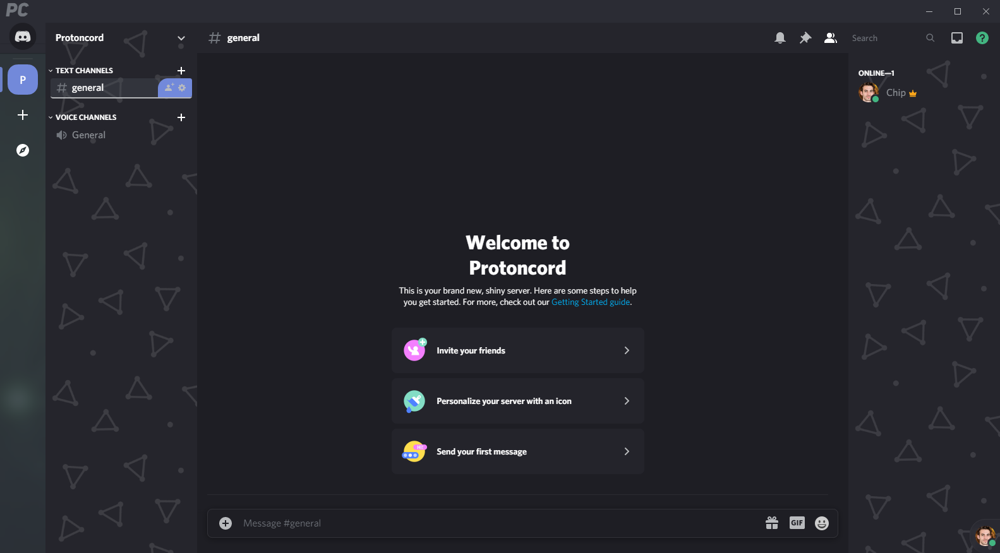
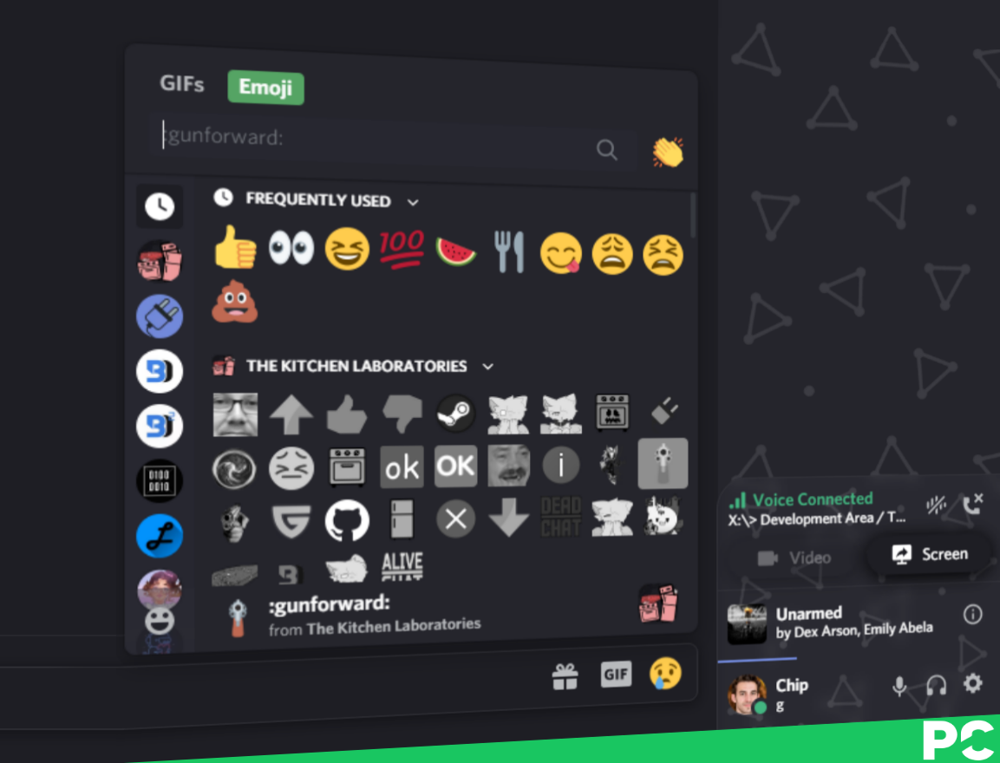

  </img>

A sleek, modern UI purely made in CSS for Discord.

Inspired by the layout of ProtonVPN.

**Pictures may not resemble most up-to-date version.**

## Attributes
* [UserBackgrounds](http://github.com/discord-Custom-Covers/usrbg/) Support
* [Glasscord](https://github.com/AryToNeX/Glasscord/) Support
* DevTag Integration
* Sleek, modern UI

### Support Server
If you need support, join [The Kitchen Laboratories](https://discord.com/invite/6aJAvdr/).

This theme is built up from the base of the [Glasscord Example Theme](https://github.com/AryToNeX/Glasscord/blob/master/extras/discord_example_theme/discord_example.theme.css). If you are a [ProtonVPN](https://protonvpn.com/) employee or a creator of the base and want this theme to be taken down, please message me via Discord: `Niko#9000`.

### Inspirations
|  |  |
|:-:|:-:|
| ProtonVPN | Naomi |

# How to install??

### Powercord
If you haven't moved your powercord folder, use this command to directly clone the theme into your themes folder.
`cd powercord/src/Powercord/themes && git clone https://github.com/Giangamerino/protoncord`

If you did move your powercord folder, change the directory string to the themes folder of where you moved it to.

### BetterDiscord
Download the [Theme File](https://github.com/Giangamerino/protoncord/blob/Release/protoncord.theme.css) and move it into your themes directory.

### Version 1.0.1
-> Bugfixes
-> Remove some unused objects
